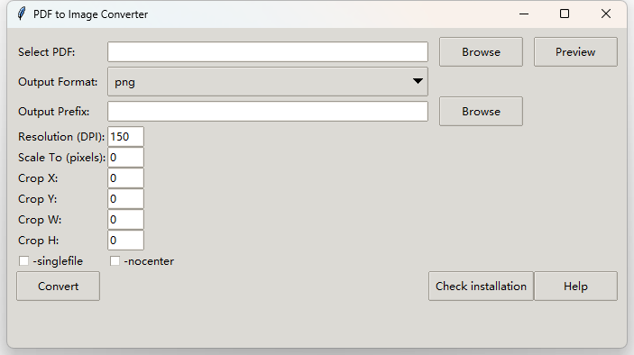

# PDF to Image Converter

This is a simple GUI application designed to convert PDF documents into various image formats using `pdftocairo`. It provides options to customize the conversion settings such as resolution, scaling, and cropping.

## Interface



## Installation

Before running this application, ensure that `pdftocairo` is installed on your system. This tool is part of the Poppler utilities package, which can be installed as follows:

### For Linux (Debian-based distributions):

```sh
sudo apt-get install -y poppler-utils
```

### For macOS:

```sh
brew install poppler
```

### For Windows:

1. Download and install Poppler for Windows from [here](https://github.com/oschwartz10612/poppler-windows).
2. Add the path to `pdftocairo.exe` to your system's PATH environment variable OR put the script to the folder with pdftocairo.exe, e.g., poppler-24.07.0\Library\bin\.

## Running the Application

### Python Version

If you have Python installed, the application requires the following packages:

- `tkinter` (part of the standard library)
- `Pillow` (Python Imaging Library)

If you need to install `Pillow`, you can do so with pip:

```sh
pip install Pillow
```

After installing the required dependencies, run the Python script:

```sh
python pdf_to_image_converter.py
```

### Precompiled EXE for Windows Users

We also provide a precompiled EXE file [https://shawkui.github.io/tools/pdf2img.exe] for Windows users. Simply download the EXE file and run it directly  (with pdftocairo installed) .

## Usage

### Interface Overview

- **Select PDF:** Choose the PDF file you wish to convert.
- **Output Format:** Select the desired output format (PNG, JPEG, TIFF, etc.).
- **Output Prefix:** Provide a prefix for the output file name.
- **Resolution (DPI):** Set the resolution for the output image.
- **Scale To (pixels):** Scale the output to a specific pixel size.
- **Crop (X Y W H):** Define the area of the PDF page to be cropped.
- **-singlefile:** Check this option to output only the first page.
- **-nocenter:** Disable automatic centering of the output.
- **Convert:** Start the conversion process.
- **Preview:** View a preview of the first page of the PDF.

### Steps to Use

1. **Select the PDF file** you want to convert using the Browse button.
2. **Choose the output format** from the dropdown menu.
3. **Provide a prefix** for the output file(s) in the Output Prefix field.
4. **Set optional parameters** like resolution, scale, or cropping.
5. **Click the Convert button** to start the conversion process.
6. The status message will indicate whether the conversion was successful.

## Help

For more detailed instructions, click the Help button within the application.

## Support

If you encounter any issues or have suggestions for improvement, please submit them through the project's issue tracker.
