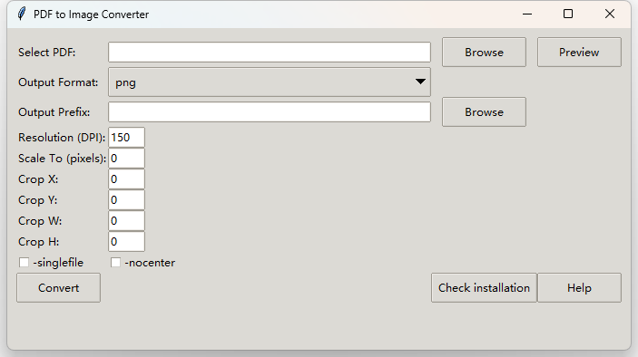

## PDF to Image Converter 简体中文

这是一个简单的图形界面应用程序，旨在使用 `pdftocairo` 将 PDF 文档转换为多种图像格式，如 "png"、"jpeg"、"tiff"、"pdf"、"ps"、"eps"、"SVG"。它提供了调整转换设置的选项，例如分辨率、缩放和裁剪等。

## 选择语言 / Select Language
- [English](./README.md)
- [简体中文](./README_CN.md)


### 界面



### 安装

在运行此应用程序之前，请确保已安装 `pdftocairo`。该工具是 Poppler 实用程序包的一部分，可以按以下步骤安装：

#### 对于 Linux（基于 Debian 的发行版）：

```sh
sudo apt-get install -y poppler-utils
```

#### 对于 macOS：

```sh
brew install poppler
```

#### 对于 Windows：

1. 从 [这里](https://github.com/oschwartz10612/poppler-windows) 下载并安装适用于 Windows 的 Poppler。
2. 将 `pdftocairo.exe` 的路径添加到系统的 PATH 环境变量中，或者将脚本放在 `pdftocairo.exe` 所在的文件夹中，例如 `poppler-24.07.0\Library\bin\`。

### 运行应用程序

#### 针对 Windows 用户的预编译 EXE 文件

我们也为 Windows 用户提供了一个预编译的 EXE 文件：
- 直接下载 ZIP 文件 [这里](https://github.com/shawkui/pdf2img/releases/download/pdf-to-image/pdf2img_v1.0.0.zip)
- 使用自行安装的 pdftocairo 运行 EXE 文件 [这里](https://github.com/shawkui/pdf2img/releases/download/pdf-to-image/pdf2img_v1.0.0.exe)

#### 使用 Python 运行

如果您已安装 Python，则应用程序需要以下包：

- `tkinter`（标准库的一部分）
- `Pillow`（Python 图像处理库）

如果需要安装 `Pillow`，可以通过 pip 安装：

```sh
pip install Pillow
```

安装所需的依赖项后，运行 Python 脚本：

```sh
python pdf2img.py
```
* 我们也实现了基于PyQT5的`pdf2img_qt.py`，提供了更好的交互页面。其依赖项可通过 ``` pip install pyqt5 ```进行安装.

### 使用说明

#### 界面概览

- **选择 PDF：** 选择您要转换的 PDF 文件。
- **输出格式：** 从下拉菜单中选择所需的输出格式（PNG、JPEG、TIFF 等）。
- **输出前缀：** 在输出前缀字段中提供输出文件名的前缀。
- **分辨率（DPI）：** 设置输出图像的分辨率。
- **缩放至（像素）：** 将输出缩放到特定的像素尺寸。
- **裁剪（X Y W H）：** 定义 PDF 页面要裁剪的区域。
- **-singlefile：** 选中此选项仅输出第一页。
- **-nocenter：** 禁用输出的自动居中。
- **转换：** 开始转换过程。
- **预览：** 查看 PDF 第一页的预览。

#### 使用步骤

1. **使用浏览按钮选择要转换的 PDF 文件**。
2. **从下拉菜单中选择输出格式**。
3. **在输出前缀字段中提供输出文件的前缀**。
4. **设置可选参数**，如分辨率、缩放或裁剪。
5. **点击转换按钮开始转换过程**。
6. 状态消息将指示转换是否成功。

### 帮助

对于更详细的说明，请点击应用程序内的帮助按钮。

### 支持

如果您遇到任何问题或有关改进的建议，请通过项目的 Issue Tracker 提交。
